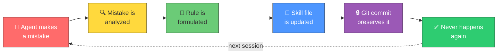

<div align="center">

# 🧠 Skill-Everythink

### Fine-tuning is frozen. RAG is blind. Your agent forgets everything tomorrow.

**What if it didn't?**

<br>

[](./LICENSE)
[](https://github.com/sordi-ai/skill-everything)
[](./CONTRIBUTING.md)

[](https://github.com/nicepkg/opencode)
[](https://docs.anthropic.com/en/docs/claude-code)
[](https://github.com/google-gemini/gemini-cli)
[](https://cursor.sh)

</div>

---

> **Fine-tuning** taught models to speak your language — then froze them in time. **RAG** gave them a library card — but no memory of what they read yesterday. **Cursor Rules** gave them a cheat sheet — stapled to one desk. **Skill-Everythink** gives them something none of those can: **experience that compounds.**

---

## 💡 Why This Matters

- 🔁 **Your agent makes the same mistake on Monday that it made last Friday.** Skill-Everythink makes that impossible — every mistake becomes a permanent rule, committed to Git, never forgotten.

- 🔓 **Your hard-won knowledge is locked inside one tool.** Switch from Cursor to Claude Code? Start over. Skill-Everythink is plain Markdown — it follows you everywhere.

- 👻 **You have no idea what your agent "remembers."** With mem0 or MemGPT, memory is a black box. With Skill-Everythink, every lesson is a file you can read, review, revert, or share with your team.

- 💸 **Fine-tuning costs thousands and produces a frozen snapshot.** Skill-Everythink costs nothing and gets smarter every single day.

- 🧩 **Your conventions live in your head, not in your agent.** Deployment order, naming rules, that one API quirk that cost you 3 hours — it all goes into structured sub-skills the agent loads automatically.

---

## ⚙️ How It Works



> **Not just errors.** The same loop captures new insights, better patterns, deployment gotchas, naming conventions, API quirks — anything worth remembering. Every lesson is a Git commit you can `diff`, `blame`, `revert`, or `cherry-pick` into another project.

---

## 📊 The Evolution of Agent Intelligence

<div align="center">

*Fine-tuning taught models to speak. RAG gave them books. Rules gave them cheat sheets.*
***Skill-Everythink gives them experience.***

</div>

| | Fine-Tuning | RAG | Cursor Rules | mem0 / MemGPT | **Skill-Everythink** |
|---|:---:|:---:|:---:|:---:|:---:|
| Learns from mistakes | ✗ | ✗ | ✗ | ✓ | **✓** |
| Git-versioned | ✗ | ✗ | ~ | ✗ | **✓** |
| Agent-agnostic | ✗ | ~ | ✗ | ~ | **✓** |
| Zero infrastructure | ✗ | ✗ | ✓ | ✗ | **✓** |
| Human-readable memory | ✗ | ✗ | ✓ | ✗ | **✓** |
| Shareable across teams | ✗ | ~ | ✗ | ✗ | **✓** |
| Self-extending | ✗ | ✗ | ✗ | ✓ | **✓** |
| Cost | $$$$ | $$$ | free | $$ | **free** |

---

## 🚀 Quick Start

```bash
git clone https://github.com/sordi-ai/skill-everything.git
```

<details>
<summary><strong>OpenCode</strong> — via <code>opencode.json</code></summary>

```json
{
  "skills": ["./skill-everything/SKILL.md"]
}
```

The `skill_resource` tool lets the agent load individual sub-skills on demand without bloating the context window.

</details>

<details>
<summary><strong>Claude Code</strong> — uses <code>CLAUDE.md</code> automatically</summary>

Just clone into your project — Claude Code discovers `CLAUDE.md` automatically. Or reference sub-skills directly:

```markdown
@references/development/code-quality.md
@references/errors/error-log.md
```

</details>

<details>
<summary><strong>Gemini CLI</strong> — uses <code>GEMINI.md</code> automatically</summary>

Just clone into your project — Gemini CLI discovers `GEMINI.md` automatically. Or import sub-skills:

```markdown
@references/development/code-quality.md
@references/errors/error-log.md
```

Use `/memory show` to verify, `/memory refresh` after edits.

</details>

<details>
<summary><strong>Cursor</strong> — via <code>.cursorrules</code></summary>

```
@file:./skill-everything/SKILL.md
```

Or paste `SKILL.md` contents directly into **Settings › Rules for AI**.

</details>

**That's it.** Your agent now has memory.

---

## 📁 What's Inside

```
skill-everything/
├── SKILL.md                    # Router — entry point (OpenCode)
├── CLAUDE.md                   # Claude Code entry point
├── GEMINI.md                   # Gemini CLI entry point
├── references/
│   ├── development/            # 23 code quality rules
│   │   └── code-quality.md     #   functions, naming, errors, perf, security
│   ├── git/                    # 15 git workflow rules
│   │   └── conventions.md      #   commits, branches, PRs, merge strategy
│   ├── domain/                 # Domain knowledge template
│   │   └── template.md         #   ADRs, naming, business rules, quirks
│   ├── process/                # Review & deployment checklists
│   │   └── review-deployment.md
│   ├── errors/                 # Error memory system
│   │   ├── error-log.md        #   structured YAML error log
│   │   └── self-extension-workflow.md
│   └── _templates/             # Templates for new skills + errors
├── CONTRIBUTING.md
└── LICENSE                     # MIT
```

---

## 🔄 Self-Extension: The Agent Teaches Itself

This is where it gets interesting. The agent doesn't just *use* the skill — it *grows* the skill:

1. **Trigger** — test fails, user corrects, wrong approach detected
2. **Search** — check if a similar error already exists (no duplicates)
3. **Analyze** — root cause, false assumption, impact
4. **Formulate** — action directive: *"Always X before Y"* or *"Never Z without W"*
5. **Commit** — `learn(errors): ERR-2025-003 — never deploy before migration`

The human reviews the PR. The agent wrote it.

> Every mistake makes the system permanently better. The improvement is a Git commit you can review, revert, or share.

---

## 🛠️ Create Your Own Skill

```bash
cp references/_templates/sub-skill.template.md references/my-area/my-skill.md
# Fill in rules, open a PR
```

Keep each sub-skill under **3,000 tokens**. Split rather than bloat. Rules are action directives, not descriptions.

---

## 🗺️ Roadmap

| Version | Status | What's included |
|---|---|---|
| **v1.1** | ✅ current | Core system · 5 starter skills · OpenCode + Claude Code + Gemini CLI + Cursor |
| **v1.2** | planned | CLI tool (`npx skill-everythink init`) for instant project setup |
| **v1.3** | planned | Consolidation loop (auto-merge similar rules) · GitHub Actions linter |
| **v2.0** | planned | Skill Marketplace — discover, rate, and embed community skills |

---

## ❓ FAQ

<details>
<summary><strong>Does this work with my agent?</strong></summary>

Yes. If your agent can read Markdown — it works. Tested with OpenCode, Claude Code, Gemini CLI, Cursor, Claude Projects, GPT-4, and local models via Ollama.

</details>

<details>
<summary><strong>How large can a skill get?</strong></summary>

Max 3,000 tokens per sub-skill. When it grows beyond that, split it. Two precise modules beat one bloated one.

</details>

<details>
<summary><strong>Can the agent really extend itself?</strong></summary>

Yes. The self-extension workflow in `references/errors/` describes exactly how the agent formulates entries, classifies them, and commits them. The human reviews the PR — the agent wrote it.

</details>

<details>
<summary><strong>What's the difference from <code>.cursorrules</code>?</strong></summary>

Cursor Rules are static, unversioned, and locked to Cursor. Skill-Everythink is modular, Git-versioned, agent-agnostic, and self-extending. A skill compounds — a `.cursorrules` file doesn't.

</details>

<details>
<summary><strong>Do I need a database?</strong></summary>

No. Plain Markdown. Git. That's it. No vector DB, no embeddings, no running processes. `git clone` is the entire setup.

</details>

<details>
<summary><strong>What if a rule is wrong?</strong></summary>

`git revert`. Every change is versioned. That's the whole point.

</details>

<details>
<summary><strong>Can I share skills across projects?</strong></summary>

Yes. Clone it as a submodule, symlink it, or just copy the `references/` folder. Skills are portable by design.

</details>

---

<div align="center">

### Built because we got tired of watching agents make the same mistakes we already taught them not to make.

**[⭐ Star this repo](https://github.com/sordi-ai/skill-everything)** if you think agents should learn from experience, not just training data.

<br>

MIT License · [Contributing](./CONTRIBUTING.md) · [Report a Bug](https://github.com/sordi-ai/skill-everything/issues)

</div>
